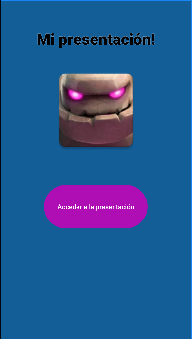
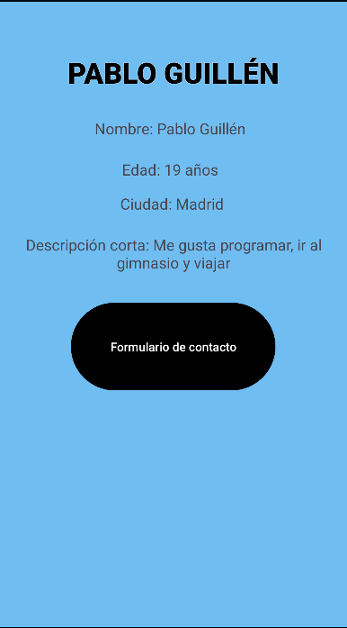
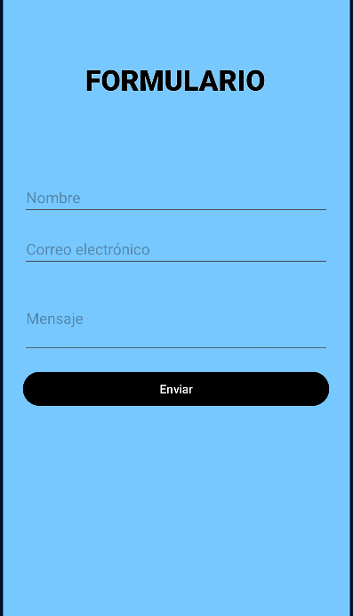

# 📱 Aplicación de Presentación Personal

Este proyecto es una aplicación Android desarrollada en **Kotlin**.  
La app tiene varias pantallas donde muestro mi presentación personal y un formulario de contacto sencillo.  
Ha sido creada para practicar la navegación entre actividades y el diseño con ConstraintLayout.

---

## 🧭 Pasos para abrir y ejecutar el proyecto

1. Abre **Android Studio**.
2. Pulsa en **"Open an existing project"**.
3. Selecciona la carpeta del proyecto.
4. Espera a que Android Studio termine de sincronizar los archivos Gradle.
5. Conecta un **emulador** o un **dispositivo físico**.
6. Haz clic en el botón **Run ▶️** para ejecutar la aplicación.

---

## 🖼️ Capturas de pantalla

### Pantalla principal (MainActivity)
Muestra el título “Mi presentación!” con una imagen y un botón para acceder a la presentación.

---

### Pantalla de presentación (PresentacionActivity)
Aquí se muestra mi nombre, edad, ciudad y una pequeña descripción personal.  
También tiene un botón que lleva al formulario de contacto.

---

### Formulario de contacto (FormularioActivity)
Pantalla con un formulario donde el usuario puede introducir su nombre, correo y mensaje.  
Al pulsar “Enviar”, aparece un texto de confirmación.

---

## ✅ Validaciones implementadas

En el formulario he añadido algunas validaciones básicas para que los campos no estén vacíos antes de enviar:

- Si el campo **nombre**, **correo** o **mensaje** está vacío, no se muestra el mensaje de confirmación.
- Cuando todos los campos están completos, se muestra un **texto de confirmación** indicando que el mensaje ha sido enviado correctamente.
- Además, el **correo electrónico** está configurado con el tipo de entrada `textEmailAddress`, para facilitar que se escriba en formato correcto.

---

## 👤 Autor

**Pablo Guillén**  
Proyecto realizado en Android Studio con Kotlin.
